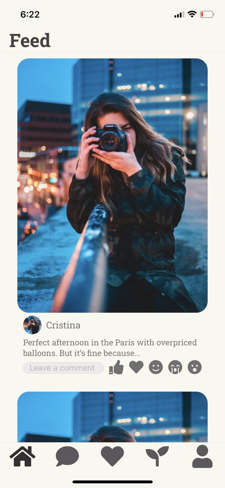

# Feed

Previous Page: [PersonalInfo](./PersonalInfo.md)

## Field in this Page
[PostField](./Feed/PostField.md)
- [ ] 圖片/內文/comment 距離30

## Issue
- [x] 命名確認為 Feed
- [x] 圖片比例 4:3
- [ ] feedback Icon 定義 
  - 一篇貼文只能按一個
  - 按下去深色
  - 大小為 25
- [ ] comment 點下去之後動態擴大 直接擋icon
- [ ] 主頁面的 bar & tab 顏色
- [ ] 子頁面 底下就不會有 tab 然後上面 bar 會有上一頁

## HTODO List
- 建立貼文的頁面設計

## CTODO List
- TODO ID on Figma: 09
- 不是每個 Child 都有 Key
- 多張 image 
- feedback icon pressable & 配色

Next Page: [Message](./Message.md)