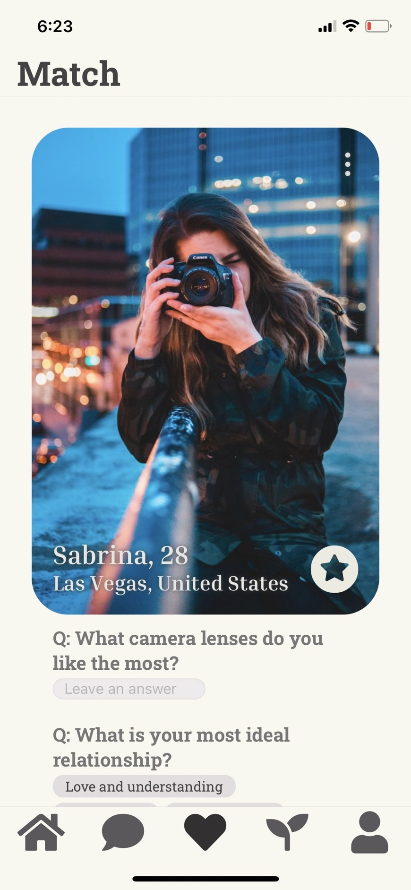
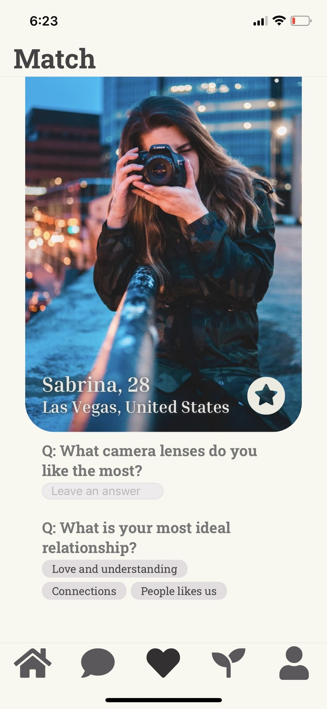

# Match

Previous Page: [Message](./Message.md)

## Link in this Pages
[Profile](./Profile.md)

## Issue
- [x] status 命名
- [ ] report > button > LIFF
- [ ] 第一頁就要看到全部照片（可以用按的換下一張）
- [ ] placeholder style 改深一點
- [ ] padding 距離之後再調
- [ ] radius style 先這樣 之後再調
- [ ] favorite 相關
  - trigger 後的反饋 => 往上滑的動畫
  - favorite 透明度 => 不用

## HTODO List
- 更新 favorite icon
- report 的 LIFF 介面

## TODO List
- TODO ID on Figma: 09
- send icon

Next Page: [Space](./Space.md)