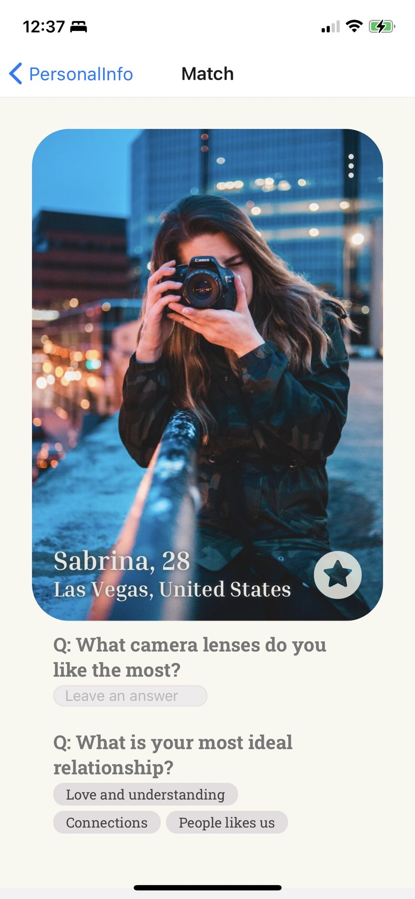

# Match

Previous Page: [Message](./Message.md)

## Link in this Pages
[Profile](./Profile.md)

## Issue
- padding 距離
- 點進去之前只能看到一張照片？
- placeholder style
- radius style
- status 命名
- report 相關
  - 介面
- favorite 相關
  - trigger 後的反饋
  - favorite 透明度
  - icon 可不可以
- 整個畫面

## TODO List
- TODO ID on Figma: 09
- send icon

Next Page: [Space](./Space.md)