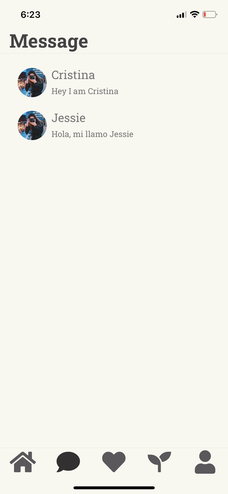

# Message

Previous Page: [Feed](./Feed.md)

## Issue
- [x] 每個人之間的格線不需要
  
## HTODO List
- 上排好友在線狀態的畫面設計
- 聊天室內頁畫面

## CTODO List
- TODO ID on Figma: 09
- 對話框 touchable
- 對話框未讀加粗 前面點點
- 上面加好友在線狀態

Next Page: [Match](./Match.md)