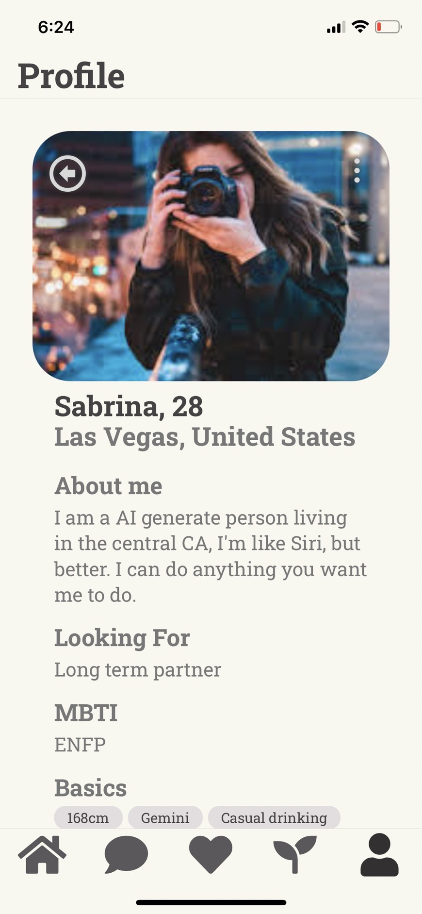
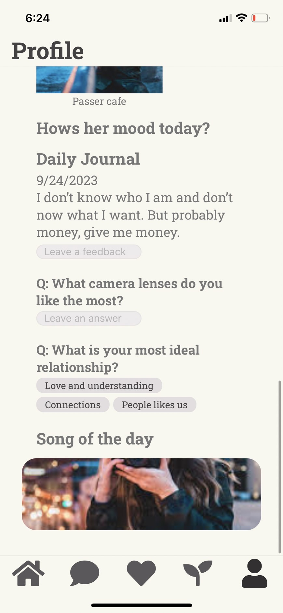

# Profile

Spacevious Page: [Space](./Space.md)

## Issue
- back 的存在需求？

## TODO List
- TODO ID on Figma: 09
- 補 底下 favorite/ Interest/ UnInterest
- 補 report function 抄 Match
- 補 favorite function 抄 Match
- 補 瀏覽狀態（自己看或別人看）
