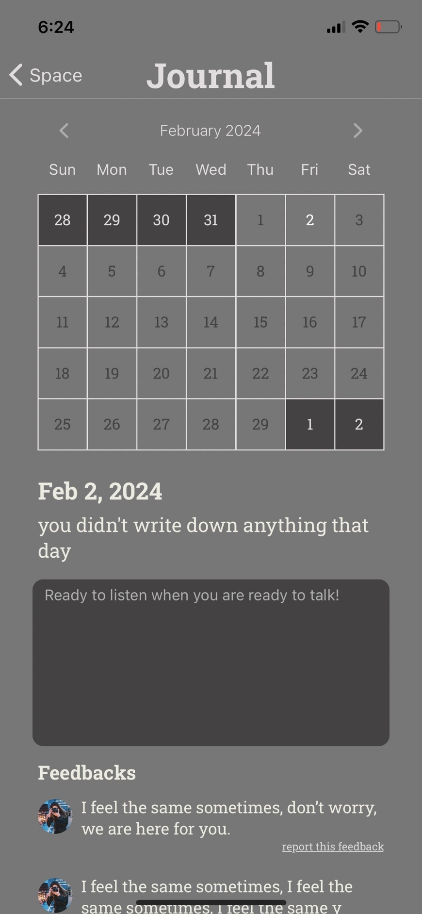
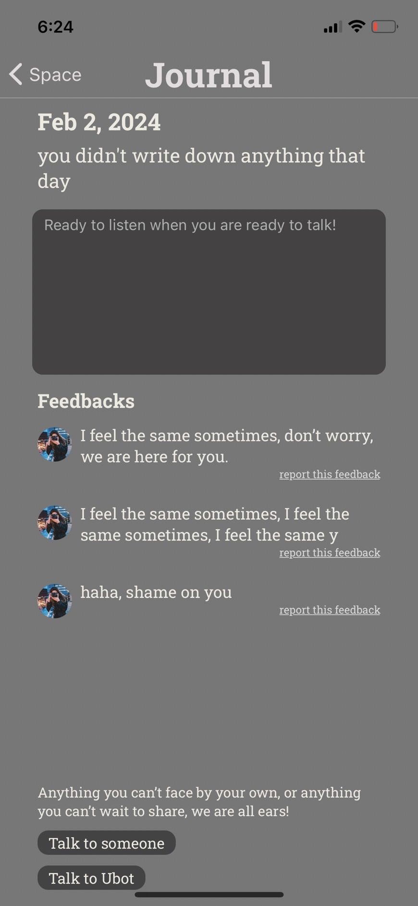

# Journal

Previous Page: [Space](../Space.md)

## Issue
- back 的必要性
- 字體排版統一性
  - 階層概念是啥
  - 可以等我出 figma demo
- 日曆相關
  - 整體字體&大小
  - 不同情況下的定義
  - today 按鈕？
  - 陰影
- 日期格式 => May 18th, 2023
- 底下 textField 定義
- FeedBack Report 長相
- 缺 talk to someone & Ubot

## TODO List
- TODO ID on Figma: 09
- 設定截止日期